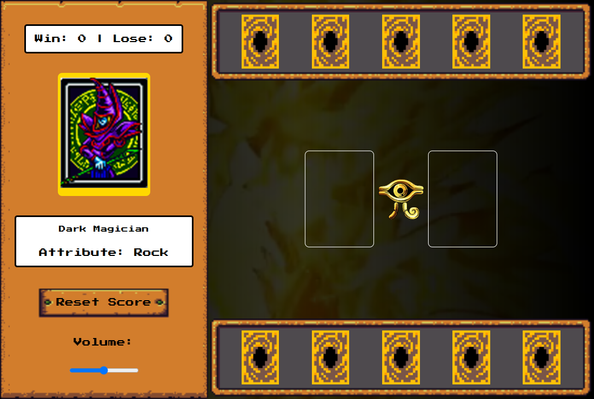

#  Yu-Gi-Oh Jo-kem-po

Bem-vindo ao projeto Yu-Gi-Oh Jo-kem-po! Neste jogo, você pode desafiar um oponente virtual em uma divertida versão de Jo-Ken-Pô, utilizando cartas do universo Yu-Gi-Oh apenas para visualização.

## Índice

- Objetivo
- Descrição do Projeto
- Como Utilizar
- Tecnologias Utilizadas
- Funcionalidades Futuras
- Contribuições
- Contato
- Observações

## 🎯 Objetivo

O objetivo deste projeto é criar uma versão interativa do clássico jogo de Jo-Ken-Pô, utilizando cartas do Yu-Gi-Oh como visualização. Os jogadores se enfrentam com as regras tradicionais de Jo-Ken-Pô, proporcionando uma experiência divertida e nostálgica.

## 📖 Descrição do Projeto 

Yu-Gi-Oh Jo-kem-po é um jogo web onde o jogador compete contra um oponente virtual em uma partida de Jo-Ken-Pô. As cartas do Yu-Gi-Oh são utilizadas apenas para representação visual, enquanto as regras do jogo seguem a dinâmica clássica do Jo-Ken-Pô.

## 🕹️ Como Utilizar

1. **Iniciar o Jogo**:
   - Navegue pelas cartas para escolher sua primeira jogada.

2. **Interagir com as Cartas**:
   - Clique na carta para jogá-la e desafiar o computador.

3. **Resetar o Jogo**:
   - Utilize o botão de reset para reiniciar a partida se for preciso.

4. **Finalização**:
   - O jogo termina quando um dos jogadores atinge 5 pontos. Um alerta será exibido ao final do jogo, indicando o vencedor.

## 🛠️ Tecnologias Utilizadas 

 

- **HTML5**: Para a estruturação do conteúdo.
- **CSS3**: Para estilização e design responsivo.
- **JavaScript**: Para a lógica do jogo e interação com o usuário.

## 🌟 Funcionalidades Futuras

- Tornar o projeto totalmente responsivo para melhor adaptação a diferentes dispositivos.
- Inclusão de mais cartas do Yu-Gi-Oh para diversificar as jogadas e experiências de jogo.
- Implementação de novas possibilidades de jogadas, como combinações de cartas ou modos de jogo alternativos.
- Utilização de uma API externa para trazer cartas dinâmicas e atualizadas do universo Yu-Gi-Oh.
- Poder selecionar o nível do adversário (fácil, médio ou difícil)

## 🤝 Contribuições

Contribuições são bem-vindas! Para contribuir:

- **Abra uma Issue:** Relate um bug ou sugira uma melhoria.
- **Crie um Pull Request:** Faça alterações no código e envie uma solicitação para revisão.

## 📧 Contato

Para dúvidas ou feedback, entre em contato:

- **E-mail:** [Leonardomoura.santos25@gmail.com](mailto:Leonardomoura.santos25@gmail.com)
- **LinkedIn:** [LinkedIn](https://www.linkedin.com/in/leonardo-moura-bb6728219/)
- **GitHub:** [GitHub](https://github.com/LeoMouraDeveloper)
- **WhatsApp:** [1194599-8234](1194599-8234)

## Observações

Este projeto é um desafio do bootcamp na DIO e está em constante melhoria.

 
 

Desenvolvido por: <a href="https://github.com/LeoMouraDeveloper">Leonardo Moura</a>.
